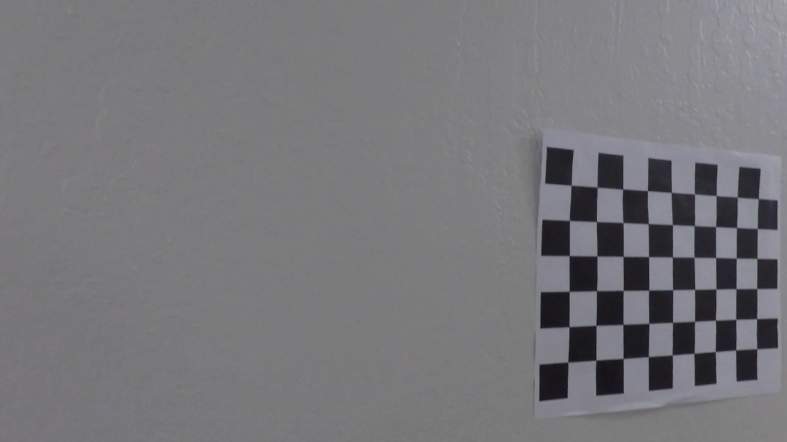
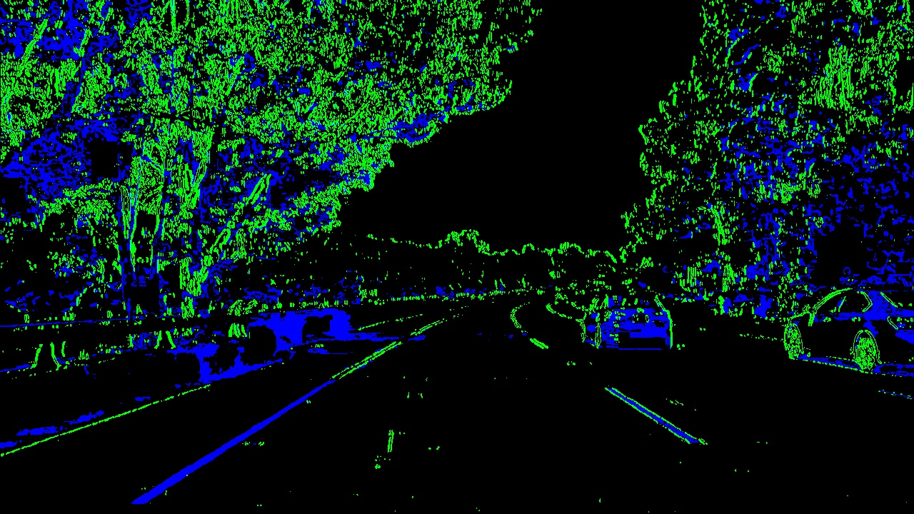
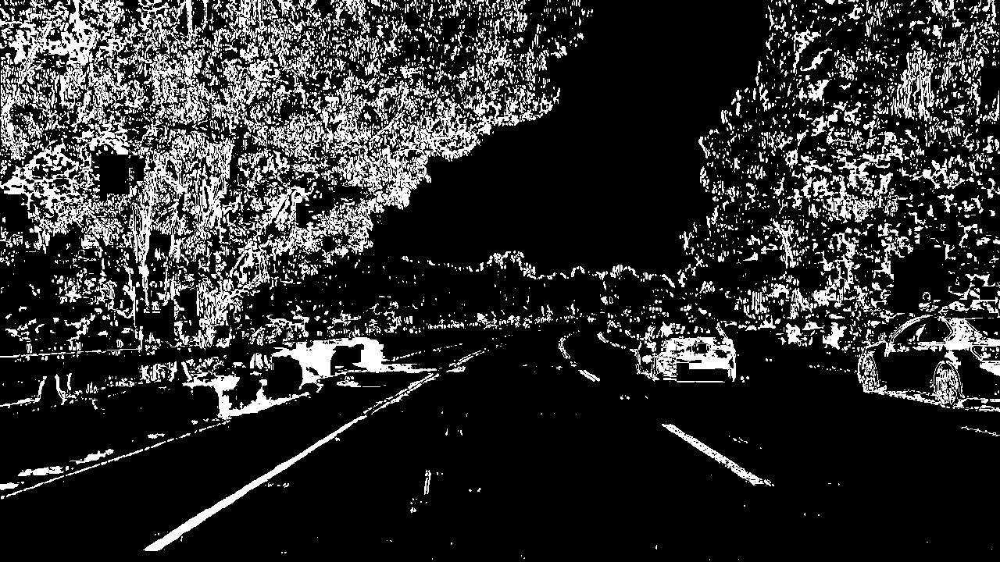
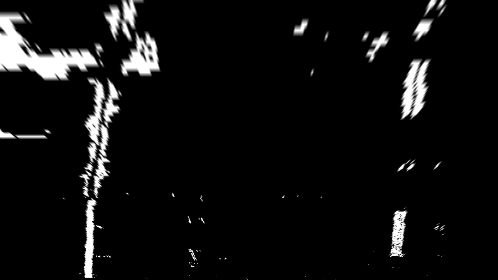

## Advanced Lane Finding Project

---
Yangchun Luo

Dec 14, 2017

This is the assignment for Udacity's Self-Driving Car Term 1 Project 4.

---
The goals / steps of this project are the following:

* Compute the camera calibration matrix and distortion coefficients given a set of chessboard images.
* Apply a distortion correction to raw images.
* Use color transforms, gradients, etc., to create a thresholded binary image.
* Apply a perspective transform to rectify binary image ("birds-eye view").
* Detect lane pixels and fit to find the lane boundary.
* Determine the curvature of the lane and vehicle position with respect to center.
* Warp the detected lane boundaries back onto the original image.
* Output visual display of the lane boundaries and numerical estimation of lane curvature and vehicle position.

[//]: # (Image References)

[image1]: ./examples/undistort_output.png "Undistorted"
[image2]: ./test_images/test1.jpg "Road Transformed"
[image3]: ./examples/binary_combo_example.jpg "Binary Example"
[image4]: ./examples/warped_straight_lines.jpg "Warp Example"
[image5]: ./examples/color_fit_lines.jpg "Fit Visual"
[image6]: ./examples/example_output.jpg "Output"
[video1]: ./project_video.mp4 "Video"

## [Rubric](https://review.udacity.com/#!/rubrics/571/view) Points

### Here I will consider the rubric points individually and describe how I addressed each point in my implementation.  

---

### Writeup / README

#### 1. Provide a Writeup / README that includes all the rubric points and how you addressed each one.  You can submit your writeup as markdown or pdf. 

You're reading it!

### Camera Calibration

#### 1. Briefly state how you computed the camera matrix and distortion coefficients. Provide an example of a distortion corrected calibration image.

The code for this step is contained in the file `camera_calibration.py`, in the function `calibrate_camera()`.

The chessboard used here has 9x6 internal corners. I started by preparing the object points of (x, y, z), from (0, 0, 0) to (8, 5, 0), assuming the z coordinate is always 0.

Then I loop through all the images in the calibration set. For every image, it is first converted to gray scale and passed `cv2.findChessboardCorners()` function. If the corners are successfully detected, the corners (9x6) and object points (9x6) are appended to their corresponding arrays.

After going through all the images, the corners and object points are passed to `cv2.calibrateCamera()` function, which returns the camera matrix and distortion coefficients. I applied this distortion correction to one of the image using the `cv2.undistort()` function and obtained this result: 

<table>
<tr><td>Before undistortion<td>After undistortion
<tr><td><td>
</table>

### Pipeline (single images)

#### 1. Provide an example of a distortion-corrected image.

The camera matrix and distortion coefficients generated from `camera_calibration.py` are dumped into a pickle file, since this is an one-time process. The lane-finding code simply loads the pickle file and apply `cv2.undistort()` with these parameters to each image for distortion correction. Here is an example of applying to a road image.

<table>
<tr><td>Before undistortion<td>After undistortion
<tr><td><td>
</table>

#### 2. Describe how (and identify where in your code) you used color transforms, gradients or other methods to create a thresholded binary image.  Provide an example of a binary image result.

I employed a combination of color and gradient thresholds to generate a binary image. The image is first converted to HLS color space. Gradient threhold is applied to the sobel on the X direction of the L channel:

    # Sobel X on L-channel
    sobelx = cv2.Sobel(l_channel, cv2.CV_64F, 1, 0)  # Take the derivative in x
    abs_sobelx = np.absolute(sobelx)  # Absolute x derivative to accentuate lines away from horizontal
    scaled_sobel = np.uint8(255 * abs_sobelx / np.max(abs_sobelx))

    # Threshold on X gradient
    sx_binary = np.zeros_like(scaled_sobel)
    sx_binary[(scaled_sobel >= sobelx_thresh[0]) & (scaled_sobel <= sobelx_thresh[1])] = 1

Color threshold is applied to the S channel:

    # Threshold on S-channel
    s_binary = np.zeros_like(s_channel)
    s_binary[(s_channel >= color_thresh[0]) & (s_channel <= color_thresh[1])] = 1
    
I created a color image to visualize the effect of both threshold methods (green for gradient, blue for color).

    # Stack each channel for visualization
    masked_color = np.dstack((np.zeros_like(sx_binary),  # Red
                              sx_binary,                 # Green
                              s_binary)                  # Blue
                             ) * 255

The processing code can be found in function `mask_lane_pixels` (line 48 through 81 in `find_lane_lines.py`). Here is an example of the output of the same image as above.

<table>
<tr><td>Colored output (for visualization)<td>Binary output (fed to downstream)
<tr><td><td>
</table>

#### 3. Describe how (and identify where in your code) you performed a perspective transform and provide an example of a transformed image.

Perspective transform is defined in function `transform_perspective` in line 84 through 92 in `find_lane_lines.py`, which takes a `src_points` and a `dst_points` parameter. I manually picked the following points, which forms a trapeziod in the original image (after distortion correction). 

| Source        | Destination   |  Location |
|:-------------:|:-------------:|:---------:| 
| 576.0, 463.5  | 260, 0        |Top left   | 
| 706.5, 463.5  | 980, 0        |Top right  |
| 208.0, 720.0  | 260, 720      |Bottom left|
| 1095.0, 720.0 | 980, 720      |Bottom right|

Here is an example of the binary output and the warped output. The two lane lines are parallel to each other.

<table>
<tr><td>Binary<td>Warped
<tr><td><td>
</table>

#### 4. Describe how (and identify where in your code) you identified lane-line pixels and fit their positions with a polynomial?

Then I did some other stuff and fit my lane lines with a 2nd order polynomial kinda like this:

![alt text][image5]

#### 5. Describe how (and identify where in your code) you calculated the radius of curvature of the lane and the position of the vehicle with respect to center.

I did this in lines # through # in my code in `my_other_file.py`

#### 6. Provide an example image of your result plotted back down onto the road such that the lane area is identified clearly.

I implemented this step in lines # through # in my code in `yet_another_file.py` in the function `map_lane()`.  Here is an example of my result on a test image:

![alt text][image6]

---

### Pipeline (video)

#### 1. Provide a link to your final video output.  Your pipeline should perform reasonably well on the entire project video (wobbly lines are ok but no catastrophic failures that would cause the car to drive off the road!).

Here's a [link to my video result](./project_video.mp4)

---

### Discussion

#### 1. Briefly discuss any problems / issues you faced in your implementation of this project.  Where will your pipeline likely fail?  What could you do to make it more robust?

Here I'll talk about the approach I took, what techniques I used, what worked and why, where the pipeline might fail and how I might improve it if I were going to pursue this project further.  
