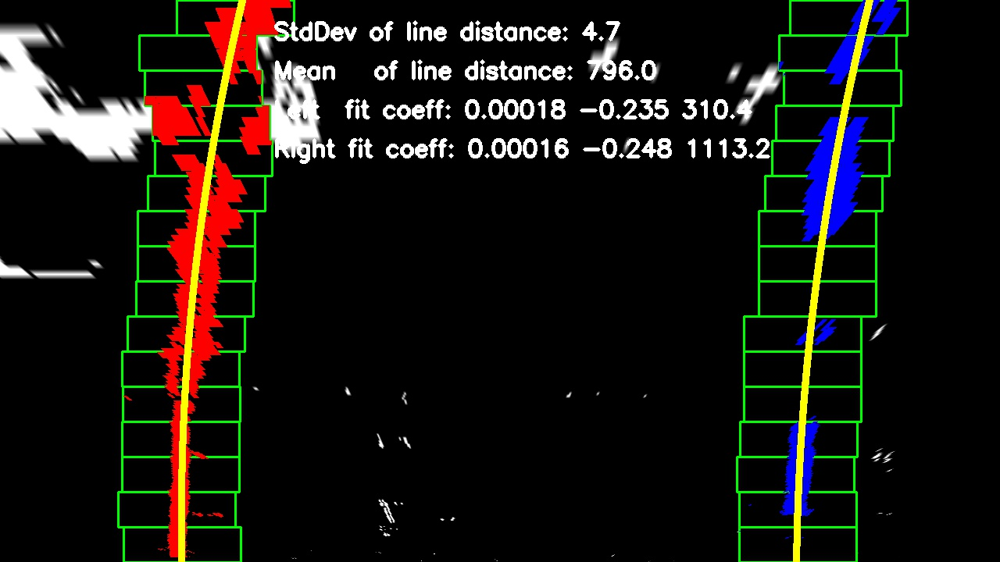
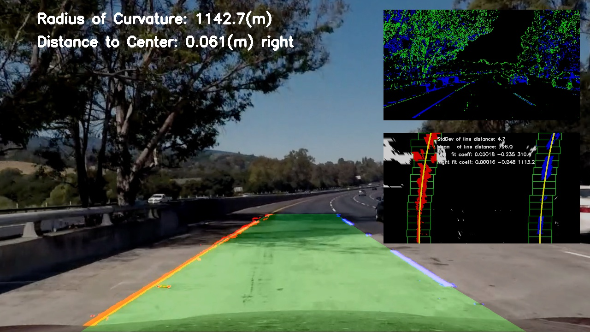
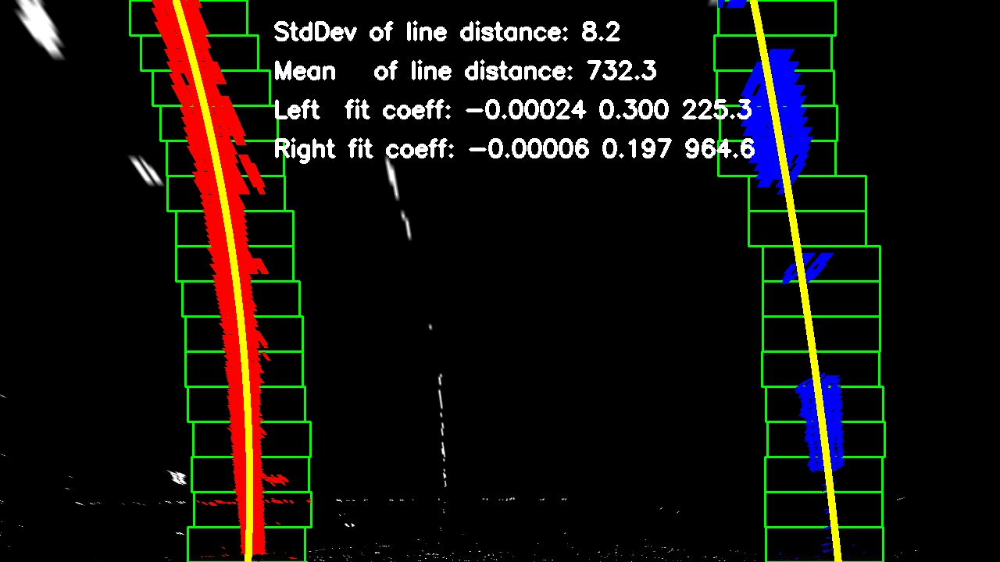
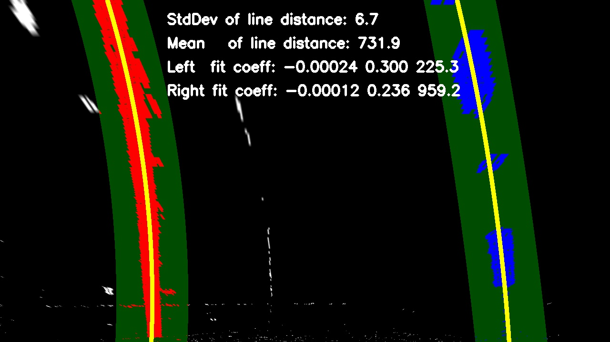

## Advanced Lane Finding Project

---
Yangchun Luo

Dec 14, 2017

This is the assignment for Udacity's Self-Driving Car Term 1 Project 4.

---
The goals / steps of this project are the following:

* Compute the camera calibration matrix and distortion coefficients given a set of chessboard images.
* Apply a distortion correction to raw images.
* Use color transforms, gradients, etc., to create a thresholded binary image.
* Apply a perspective transform to rectify binary image ("birds-eye view").
* Detect lane pixels and fit to find the lane boundary.
* Determine the curvature of the lane and vehicle position with respect to center.
* Warp the detected lane boundaries back onto the original image.
* Output visual display of the lane boundaries and numerical estimation of lane curvature and vehicle position.

[//]: # (Image References)

[image1]: ./examples/undistort_output.png "Undistorted"
[image2]: ./test_images/test1.jpg "Road Transformed"
[image3]: ./examples/binary_combo_example.jpg "Binary Example"
[image4]: ./examples/warped_straight_lines.jpg "Warp Example"
[image5]: ./examples/color_fit_lines.jpg "Fit Visual"
[image6]: ./examples/example_output.jpg "Output"
[video1]: ./project_video.mp4 "Video"

## [Rubric](https://review.udacity.com/#!/rubrics/571/view) Points

### Here I will consider the rubric points individually and describe how I addressed each point in my implementation.  

---

### Writeup / README

#### 1. Provide a Writeup / README that includes all the rubric points and how you addressed each one.  You can submit your writeup as markdown or pdf. 

You're reading it!

### Camera Calibration

#### 1. Briefly state how you computed the camera matrix and distortion coefficients. Provide an example of a distortion corrected calibration image.

The code for this step is contained in the file `camera_calibration.py`, in the function `calibrate_camera()`.

The chessboard used here has 9x6 internal corners. I started by preparing the object points of (x, y, z), from (0, 0, 0) to (8, 5, 0), assuming the z coordinate is always 0.

Then I loop through all the images in the calibration set. For every image, it is first converted to gray scale and passed to the `cv2.findChessboardCorners()` function. If the corners are successfully detected, the corners (9x6) and corresponding object points (9x6) are appended to their respective arrays.

After going through all the images, the corners and object points are passed to `cv2.calibrateCamera()` function, which returns the camera matrix and distortion coefficients. I applied this distortion correction to one of the images using the `cv2.undistort()` function and obtained this result: 

<table>
<tr><td>Before undistortion<td>After undistortion
<tr><td><td>
</table>

### Pipeline (single images)

#### 1. Provide an example of a distortion-corrected image.

The camera matrix and distortion coefficients generated from `camera_calibration.py` are dumped into a pickle file, since this is an one-time process. The lane-finding code simply loads the pickle file and apply `cv2.undistort()` with these parameters to each image for distortion correction. Here is an example of applying to a road image.

<table>
<tr><td>Before undistortion<td>After undistortion
<tr><td><td>
</table>

#### 2. Describe how (and identify where in your code) you used color transforms, gradients or other methods to create a thresholded binary image.  Provide an example of a binary image result.

I employed a combination of color and gradient thresholds to generate a binary image. The image is first converted to HLS color space.

    hls = cv2.cvtColor(img, cv2.COLOR_RGB2HLS).astype(np.float)
    l_channel = hls[:, :, 1]
    s_channel = hls[:, :, 2]

Gradient threshold is applied to the sobel on the X direction of the L channel:

    # Sobel X on L-channel
    sobelx = cv2.Sobel(l_channel, cv2.CV_64F, 1, 0)  # Take the derivative in x
    abs_sobelx = np.absolute(sobelx)  # Absolute x derivative to accentuate lines away from horizontal
    scaled_sobel = np.uint8(255 * abs_sobelx / np.max(abs_sobelx))

    # Threshold on X gradient
    sx_binary = np.zeros_like(scaled_sobel)
    sx_binary[(scaled_sobel >= sobelx_thresh[0]) & (scaled_sobel <= sobelx_thresh[1])] = 1

Color threshold is applied to the S channel:

    # Threshold on S-channel
    s_binary = np.zeros_like(s_channel)
    s_binary[(s_channel >= color_thresh[0]) & (s_channel <= color_thresh[1])] = 1
    
I created a color image to visualize the effect of both threshold methods (green for gradient, blue for color).

    # Stack each channel for visualization
    masked_color = np.dstack((np.zeros_like(sx_binary),  # Red
                              sx_binary,                 # Green
                              s_binary)                  # Blue
                             ) * 255

The aforementioned processing code can be found in function `mask_lane_pixels` (line 48 through 81 in `find_lane_lines.py`). Here is an example of the output of the same image as above.

<table>
<tr><td>Colored output (for visualization)<td>Binary output (fed to downstream)
<tr><td><td>
</table>

#### 3. Describe how (and identify where in your code) you performed a perspective transform and provide an example of a transformed image.

Perspective transform is defined in function `transform_perspective` in line 84 through 92 in `find_lane_lines.py`, which takes a `src_points` and a `dst_points` parameter. I manually picked the following points, which forms a trapezoid in the original image (after distortion correction). 

| Source        | Destination   |  Location |
|:-------------:|:-------------:|:---------:| 
| 576.0, 463.5  | 260, 0        |Top left   | 
| 706.5, 463.5  | 980, 0        |Top right  |
| 208.0, 720.0  | 260, 720      |Bottom left|
| 1095.0, 720.0 | 980, 720      |Bottom right|

Here is an example of the binary output and the warped output. The two lane lines are parallel to each other.

<table>
<tr><td>Binary<td>Warped
<tr><td><td>
</table>

#### 4. Describe how (and identify where in your code) you identified lane-line pixels and fit their positions with a polynomial?

##### Lane-line pixel detection

The code that detect lane-line pixels is defined in line 255 through 299 in the function `detect_lanes` in `find_lane_lines.py`.

1. Find the left and right lane base X location through the histogram method. (In video feed, this may come from the X position averaged over previous frames).
2. Divide the Y coordinate space into N=16 windows. The X coordinate of the window is calculated by the current X location plus/minus a margin (75 pixels).
3. Start from the bottom of the image to trace the lane pixels in each window.
4. When the number of lane pixels in the window is greater than a threshold (t1=100), center the X coordinate of the next window to the average X coordinate of the pixels in this window. If the number is smaller than another threshold (t2=10), center the next window to the starting position. Otherwise, do not update the X position of the next window.
5. Repeat the last step for all the search windows.

One noted **improvement** is in step 4, when the number of pixels in the window is too small, instead of not changing the next window location, move it back to base position. I found it quite helpful in the search process for some difficult frames.

##### Fit a polynomial

The code that fit a polynomial is defined in line 301 through 318 in the function `detect_lanes` in `find_lane_lines.py`. I fitted two polynomials, one for pixel distance, one for world distance (see next Rubric Point for its use).

    coeff_pixel = {}
    coeff_world = {}
    fitx = {}
    for which, color in [("left", [255, 0, 0]), ("right", [0, 0, 255])]:
        # Extract line pixel positions
        lane_x = nonzerox[nonzero_idx[which]]
        lane_y = nonzeroy[nonzero_idx[which]]
        # Color the pixels for visualization
        canvas[lane_y, lane_x] = color
        pixels[lane_y, lane_x] = color

        # Fit a second order polynomial on pixel distance
        coeff_pixel[which] = np.polyfit(lane_y, lane_x, deg=2)
        fitx[which] = poly_value(ploty, coeff_pixel[which])

        # Fit a second order polynomial on world distance
        coeff_world[which] = np.polyfit(lane_y * ym_per_pixel, lane_x * xm_per_pixel, deg=2)

##### Sanity check

A sanity check is performed using the following criteria, where the thresholds were found empirically by observing a few difficult frames in the video feed.

* The standard deviation of left and right lane line distance is less than 30
* The mean of left and right lane line distance is greater than 500

Here is the visualization of the search process on the same test image as above. All numbers on the image are based on pixel distance. When an image failed the sanity check, a red text line would be display (not shown in this case).

#### 5. Describe how (and identify where in your code) you calculated the radius of curvature of the lane and the position of the vehicle with respect to center.

Such code is defined in line 357 through 369 in the function `detect_lanes` in `find_lane_lines.py`. The value is evaluated by the bottom of the image (where the vehicle is at). I used **geometric mean for radius of curvature** because it is found more stable, given that radius has quite large variance especially for a straight line.

    def poly_value(yval, coeffs):
        return coeffs[0] * yval ** 2 + coeffs[1] * yval + coeffs[2]

    def radius_of_curvature(yval, coeffs):
        return ((1 + (2 * coeffs[0] * yval + coeffs[1]) ** 2) ** 1.5) / np.absolute(2 * coeffs[0])

    lane_radius = {}
    lane_xpos = {}
    for which in ['left', 'right']:
        curv = radius_of_curvature(np.max(ploty) * ym_per_pixel, coeff_world[which])
        debug and print(which, "curvature", curv)
        lane_radius[which] = curv
        lane_xpos[which] = poly_value(np.max(ploty), coeff_pixel[which])
        
    # Geometric mean is more stable for radius
    def get_geomean(iterable):
        a = np.log(iterable)
        return np.exp(a.sum() / len(a))
    
    avg_radius = get_geomean(list(lane_radius.values()))
    dist_center = (midpoint - np.mean(list(lane_xpos.values()))) * xm_per_pixel

#### 6. Provide an example image of your result plotted back down onto the road such that the lane area is identified clearly.

Such code is defined in line 340 through 354, where the polygon is draw on the warped image:

    # 4. Draw the region between left and right lane lines.
    region_pts = {}
    for which in ['left', 'right']:
        # Visualize the fitted curve on the canvas
        # The equivalent of matplotlib.pyplot.plot(X, Y)
        for x, y in zip(fitx[which], ploty):
            cv2.circle(canvas, center=(int(x), int(y)), radius=3, color=[255, 255, 0], thickness=2)

        # Generate the polygon points to draw the fitted lane region.
        pts = np.transpose(np.vstack([fitx[which], ploty]))
        if which == 'right':
            # So that when h-stacked later, the bottom left lane is adjacent to the bottom right lane (U-shape).
            pts = np.flipud(pts)
        region_pts[which] = np.array([pts])  # Don't miss the [] around pts
    cv2.fillPoly(region, np.int_([np.hstack(region_pts.values())]), (0, 255, 0))
    
as well as in line 438 and 442, where the polygon region is warped back to the original perspective.

    # Highlight the lanes on the original image. First warp it back.
    warpback = cv2.warpPerspective(region, Minv, img_size)
    result = cv2.addWeighted(undist, 1, warpback, 0.3, 0)

Here is an example of my result on a test image. I further overlay the colored threshold image and lane line detection image on it for better debugging and visualization.

---

### Pipeline (video)

#### 1. Provide a link to your final video output.  Your pipeline should perform reasonably well on the entire project video (wobbly lines are ok but no catastrophic failures that would cause the car to drive off the road!).

Here's a [link to my video result](./result_project_video.mp4)

A few improvements from processing individual images to continuous video feed:

* **Detection/tracking**: when the lane line is found in previous frames, I only search within a margin (75 pixels) around the fitted X position based on the aggregated coefficients. This improves accuracy for some difficult to detect frames as well as processing speed. When N=5 consecutive frames fail the sanity check, I go back to detection mode. 
* **Smoothing**: I aggregate the fit coefficients as well as X base position using an exponential decay rate of 0.8. This improves the stability of the result and avoids jitter.

The above is implemented using a LaneHistoryInfo class. The update logic is the following:

        if not success:  # Failed sanity check
            lane_hist.n_continuous_failure += 1
            if lane_hist.n_continuous_failure > lane_hist.continuous_failure_threshold:
                lane_hist.use_tracking = False
                lane_hist.use_xbase = False
        else:
            lane_hist.use_tracking = True
            lane_hist.use_xbase = True
            # Exponential decay and update coefficients and xbase positions
            rate = lane_hist.decay_rate ** (lane_hist.n_continuous_failure + 1)
            for which in ['left', 'right']:
                lane_hist.xbase_position[which] *= rate
                lane_hist.xbase_position[which] += lane_xpos[which] * (1 - rate)
                lane_hist.fit_coeffs[which] *= rate
                lane_hist.fit_coeffs[which] += coeff_pixel[which] * (1 - rate)
                ...
                lane_hist.n_continuous_failure = 0

Here are two consecutive frames from a videos where the first is in detection mode and second in tracking mode.

<table>
<tr><td>Frame n: detection<td>Frame n+1: tracking
<tr><td><td>
</table>

---

### Discussion

#### 1. Briefly discuss any problems / issues you faced in your implementation of this project.  Where will your pipeline likely fail?  What could you do to make it more robust?

First, let me summarize the improvements/optimizations that I found useful in addition to what was given in course lecture:

* In window search, when the number of pixels in the window is too small, instead of remaining where the window is, go back to the base position.
* Use geometric mean for the radius of curvature between left and right lanes, instead of arithmetic mean.
* In sanity check, make sure the lane lines are well separated (mean distance greater than a threshold), in addition to having small variance.
* Use exponential decay to average over past frames' results. Another benefit is that there is no need to maintain a queue or dealing with corner cases like the queue is not full when averaging.

Another useful tip is to overlay intermediate images (colored threshold and detection/tracking process) as well as some parameters on the final output image. It is tremendously helpful to see all the necessary information in one shot to gain insight to why this frame works or does not work, especially in the video feed.

##### Areas for further improvement:

* Better tuning of the threshold method (color and gradient)
* Reject outliers when fitting the curve
* Better sanity check criteria

